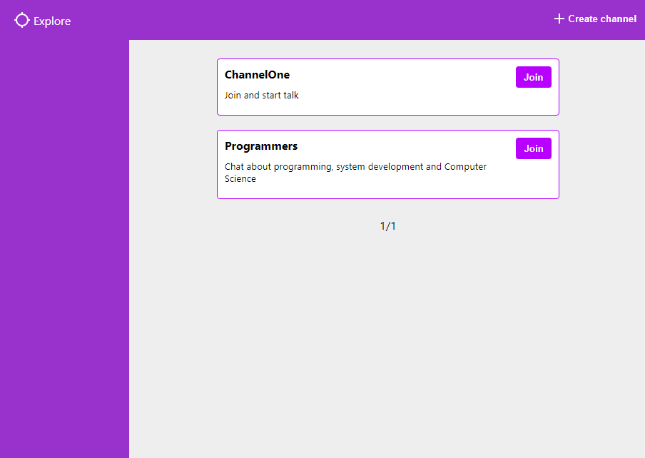

# SignalR chat

Application built to study ASP NET Core and ReactJS



Real-time chat application with multiple channels

## Features

-   Create channels
-   Join channels
-   Real-time chat (without data persistence)

## Built with

-   [SignalR](https://dotnet.microsoft.com/apps/aspnet/signalr): ASP NET Core library to real-time comunication
-   Backend
    -   [ASP NET Core](https://docs.microsoft.com/en-us/aspnet/core/?view=aspnetcore-3.1): Cross-plataform framework to build web apps
    -   [SQL SERVER](https://www.microsoft.com/en-us/sql-server): Microsoft Relational Database
    -   [Fluent Migrator](https://github.com/fluentmigrator/fluentmigrator): Migration framework to .NET
    -   [Dapper](https://dapper-tutorial.net/dapper): Micro ORM
    -   [Flunt](https://github.com/andrebaltieri/flunt): Notification Pattern library
    -   Tests
        -   [xUnit](https://xunit.net/): Unit testing tool for the .NET
        -   [Fluent Assertions](https://fluentassertions.com/): Fluent API for asserting the results of unit tests
        -   [Moq](https://github.com/moq/moq): Mocking framework for .NET
-   Fontend
    -   [ReactJS](https://reactjs.org/): JavaScript library for building user interfaces
    -   [Typescript](https://www.typescriptlang.org/): Typed superset of JavaScript
    -   [React Router DOM](https://reacttraining.com/react-router/web/guides/quick-start): Declarative routing for React
    -   [@uifabric/styling](https://github.com/microsoft/fluentui/tree/master/packages/styling): Styling package of Microsoft [Fluent UI React](https://github.com/microsoft/fluentui/)

## Getting started

### Requires

-   [SQL SERVER](https://www.microsoft.com/en-us/sql-server/sql-server-downloads)
-   [.NET Core 3.1 SDK](https://dotnet.microsoft.com/download)
-   [NodeJS](https://nodejs.org/en/)
-   [Yarn](https://yarnpkg.com/)

### Clone

Clone this repository

```
git clone https://github.com/fernandovmp/signalr-chat
```

Then, change to repository folder

```
cd signalr-chat
```

### Build and restore .NET projects

```
dotnet build
```

### Run migrations

Install fluent migrator CLI tool

```
dotnet tool install -g FluentMigrator.DotNet.Cli
```

Run migrations

```
dotnet-fm migrate -p sqlserver -c "{connection string here}" -a "./src/SignalRChat.Infrastructure/bin/Debug/netstandard2.0/SignalRChat.Infrastructure.dll"
```

### Run tests

```
dotnet test
```

### Run the signalr server

First, create a appsettings.json file in `./src/SignalRChat.Server` with the following content:

```json
{
    "ConnectionStrings": {
        "ConnectionString": "{connection string here}"
    }
}
```

Then

```
dotnet run --project ./src/SignalRChat.Server
```

### Install frontend packages running:

```
yarn --cwd ./src/web-client
```

### Run the frontend app

```
yarn --cwd ./src/web-client start
```
